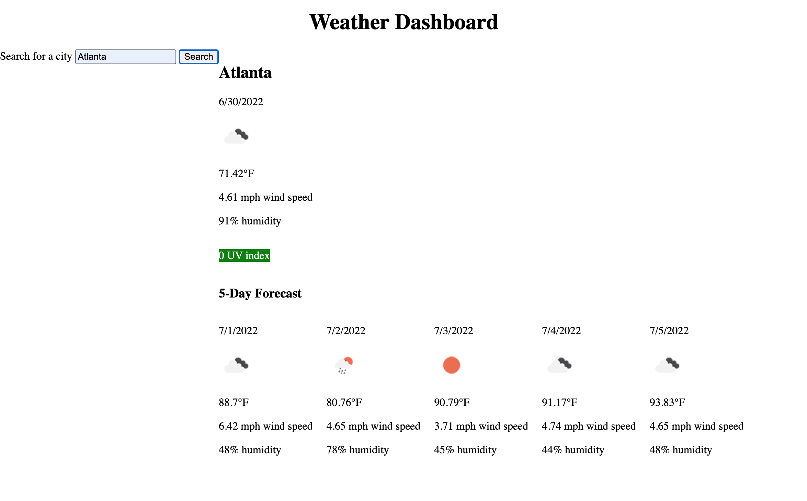

# Module 6 Challenge
# GWU Web Dev Bootcamp (Spring 2022)

This repo contain's my (Matt Neal's) work on the sixth challenge, which consists of a weather dashboard.
The webpage can be viewed at https://nealmm.github.io/weather-dashboard/.

## Screenshot
